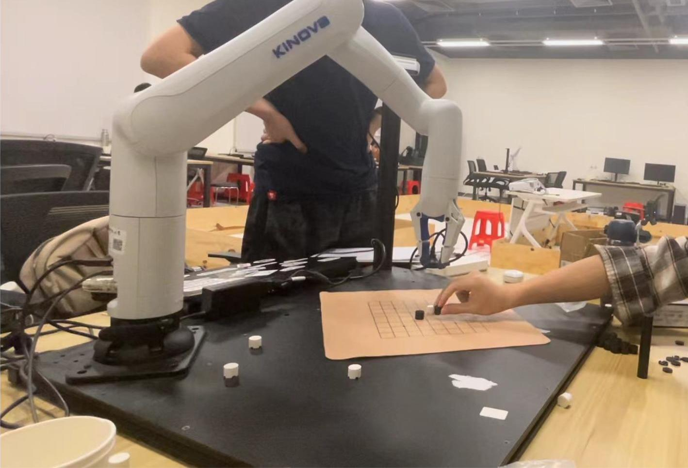
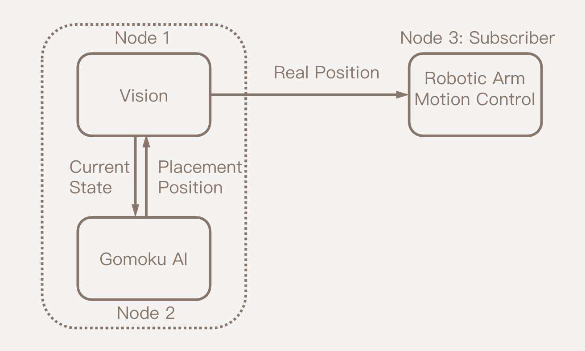

# SUSTech EE368 Robotic Motion and Control Project

## Introduction

This project is a robotic system that can play Gomoku with a human player. 



We use Intel D435 camera and Kinova Gen3 Lite robot arm to build the system. ROS1 neotic, OpenCV, and AlphaZero are used in the project.

## Usage 

First build the workspace:
```shell
$ catkin_make
$ source devel/setup.bash
```

For the completed function, you need to run the following three parts:

#### Gomoku Vision
```shell
$ roscore
$ rosrun gomoku_vision vision_node.py
```

If you can not connect to the camera (that's very common), you can use the `planc` to simulate the camera function:
```shell
$ rosrun gomoku_vision planc.py
```

#### Gomoku AI
```shell
$ rosrun gomoku_ai ai_node.py
```

#### Gomoku Control
```shell
$ roslaunch kortex_driver kortex_driver.launch
$ roslaunch gomoku_control pick_and_place_example.launch
```

Test example: `$ rostopic pub /my_gen3_lite/arm_point geometry_msgs/Point '{x: 0.427, y: 0.07, z: 0.1}'`


## Development
### Software Architecture

Below is the system architecture:


Framework: ROS1 Neotic (Ubuntu 20.04)

#### Nodes:
- gomoku_vision
- gomoku_ai
- gomoku_control

#### Messages:

- /arm_pose: `geometry_msgs/Point`

    The desired position of the piece to be placed.
    From *gomoku_vision* to *gomoku_control*

- /piece_position: `std_msgs/UInt8MultiArray`

    from gomoku_vision to gomoku_ai

- /next_move: `std_msgs/UInt8MultiArray`

    from gomoku_ai to gomoku_vision

- /victory: `std_msgs/Int8`

    from gomoku_vision to gomoku_control


### Hardware Architecture
- Kinova Gen3 Lite: 6DOF Robot Arm
- Intel RealSense D435: RGBD Camera
- Lego 2x2 cylinder bricks: Gomoku pieces

### Commits
Follow the format proposed in the [Semantic Commits](https://gist.github.com/joshbuchea/6f47e86d2510bce28f8e7f42ae84c716)

## Contributors
This project is developed by the group 1 of EE368 Robotic Motion and Control course in SUSTech. 

<a href="https://github.com/squarezhong/SUSTech-EE368-Project/graphs/contributors">
  
</a>

## License
[Apache License 2.0](LICENSE)
